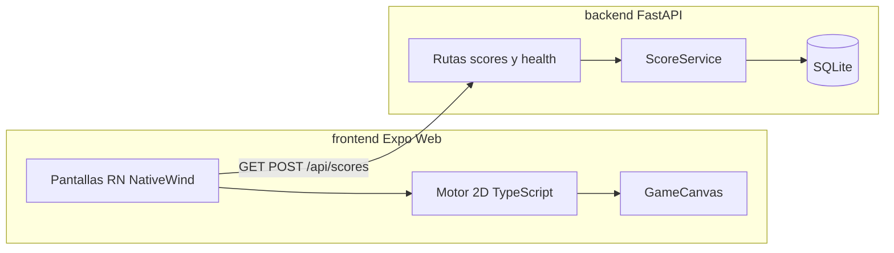
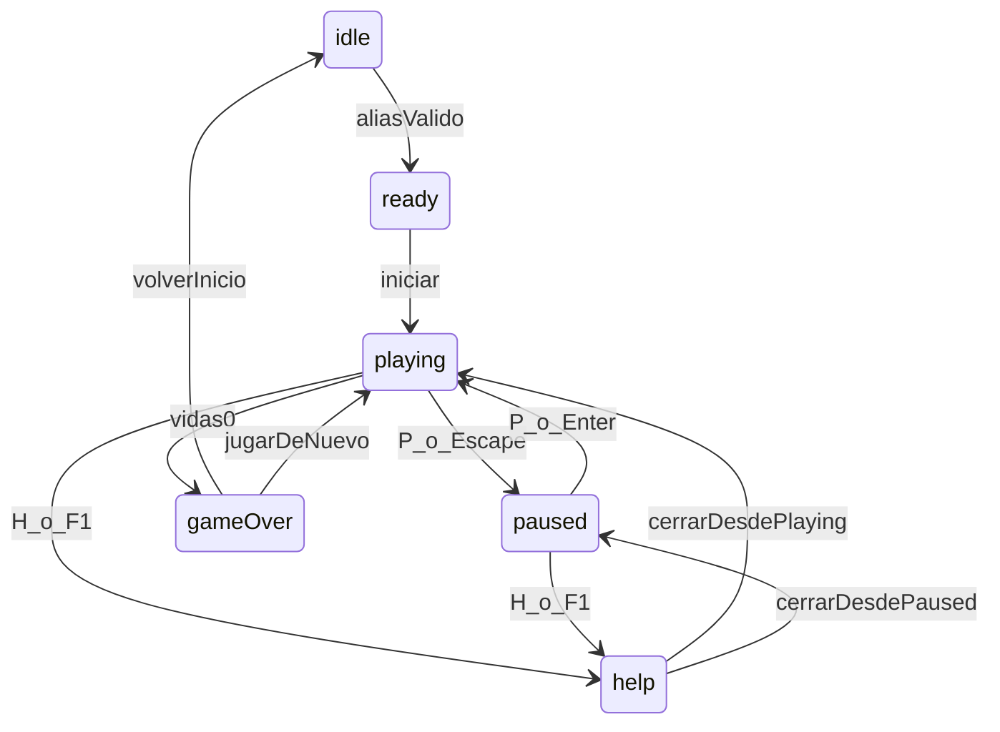

# Plan: NEON SWARM — videojuego retro tipo invaders

Este plan se persistirá en [`Documentacion/Planes/plan_1_crear_juego.md`](Documentacion/Planes/plan_1_crear_juego.md) al iniciar la implementación (la carpeta aún no existe). El repositorio hoy solo contiene [`README.md`](README.md) y [`Documentacion/Intenciones/intencion_1_crear_juego.md`](Documentacion/Intenciones/intencion_1_crear_juego.md).

Nombre original del juego: **NEON SWARM**. Estética arcade 8-bit / neón. Sin marcas, sprites ni sonidos de Space Invaders.

Idioma de interfaz: **español**, alineado con las pantallas de la intención (“Juego pausado”, menú de ayuda, tips).

---

## Decisiones técnicas

- **Render del playfield:** HTML Canvas en Expo Web (`requestAnimationFrame` + delta time). Las pantallas de menú (inicio, pausa, ayuda, game over) son componentes React Native + NativeWind. Motivo: teclado físico es obligatorio y el loop 2D es más estable en canvas que con Views absolutas.
- **ORM:** SQLModel (Pydantic + SQLAlchemy) para alinear esquemas FastAPI y persistencia.
- **Puntaje:** tabla de la intención sin cambios (básico 100, rápido 150, resistente 250, bonus oleada 500).
- **Persistencia local extra:** AsyncStorage guarda el último alias válido para no reescribirlo cada partida.
- **CORS:** backend permite `http://localhost:8081` y `http://localhost:19006` (Expo Web).



Máquina de estados:



---

## UX / UI / UX Writing (verbosidad media)

Objetivo: mensajes claros, no telegráficos ni novelas. Cada pantalla tiene **título + 1 frase de contexto + 1 tip**. El menú Ayuda es la fuente canónica de reglas y controles.

### Sistema de copy

Centralizar textos en [`frontend/src/copy/es.ts`](frontend/src/copy/es.ts) (un solo archivo, fácil de ajustar). Tonos:

- **Indicación:** qué hacer ahora (“Escribe tu alias para entrar al hangar”).
- **Sugerencia:** cómo hacerlo mejor (“Usa 3 a 20 caracteres: letras, números, espacio, - o _”).
- **Tip:** dato útil no bloqueante (“Cada 1000 puntos ganas una vida extra. Solo una vez por cada múltiplo”).
- **Error:** qué falló y cómo corregirlo (“El alias es demasiado corto. Prueba con al menos 3 caracteres”).
- **Éxito:** confirmación breve (“Puntaje guardado en el ranking local”).

Verbosidad media: 1–2 oraciones por mensaje. Evitar jerga técnica en UI (“timeout”, “500”, “payload”). Si la API falla, mostrar “No se pudo guardar el puntaje. Revisa que el servidor esté en marcha y vuelve a intentar.”

### Identidad visual

- Fondo `#050510`, acentos neón: cian `#22D3EE`, magenta `#F472B6`, lima `#A3E635`, ámbar `#FBBF24`.
- Tipografía monoespaciada (`Press Start 2P` o `VT323` vía Google Fonts en web; fallback `monospace`).
- HUD fijo: alias | oleada | puntaje | vidas (iconos geométricos, no sprites de terceros).
- Botones grandes (`RetroButton`): min-height 48px, borde 2–3px, hover/focus visible, labels con verbo (“Iniciar partida”, “Reanudar”, “Ver ranking”).
- Entidades del canvas: naves y enemigos con polígonos/rectángulos propios (cañón cian, swarm magenta/lima/ámbar por tipo).
- Responsive: playfield centrado, máximo ~960×640; en viewports estrechos el canvas escala y el HUD se apila.

### Pantallas y microcopy (resumen)

1. **Inicio (`idle`/`ready`):** título NEON SWARM, campo alias con placeholder “Tu alias de piloto”, validación en vivo, ranking top 5, CTA “Iniciar partida” deshabilitado hasta alias válido, botón “Ayuda”, tip rotativo bajo el form.
2. **Juego:** canvas + HUD + botones Pausar / Ayuda. Primeros 8s: overlay suave “← → mover · Espacio disparar · H ayuda” que se desvanece.
3. **Pausa:** “Juego pausado” + “El enjambre se detuvo. Reanuda cuando quieras.” Acciones: Reanudar, Reiniciar, Ayuda.
4. **Ayuda (modal, pausa el loop):** objetivos, tabla de controles, vidas (3 iniciales), vida extra cada 1000, tip de oleadas. Cerrar con botón, Escape o H.
5. **Game over:** alias, puntaje, oleada, posición en ranking (“Quedaste #3 de 10”) o “Entraste al ranking” / “Sigue practicando para entrar al top 10”. CTAs: Jugar de nuevo, Volver al inicio.

Toasts no bloqueantes para: vida extra, oleada limpiada, error de red, puntaje guardado.

Accesibilidad mínima: foco de teclado en menús, contraste AA en textos, `aria-label` en botones, no depender solo del color para vidas.

---

## Estructura de carpetas

```txt
backend/
  app/main.py
  app/core/config.py
  app/db/{database.py,models.py,session.py}
  app/schemas/score_schema.py
  app/services/score_service.py
  app/api/routes/{scores.py,health.py}
  app/tests/test_scores.py
  requirements.txt
  README.md
frontend/
  src/app/App.tsx
  src/components/{GameCanvas,HelpModal,ScoreBoard,PlayerForm,RetroButton,Hud,Toast,PauseOverlay,GameOverOverlay}
  src/copy/es.ts
  src/game/{engine,collisions,constants,entities,input,scoring,stateMachine,waves}.ts
  src/services/{apiClient,scoreService}.ts
  src/storage/localPlayerStorage.ts
  src/types/{game.types,score.types}.ts
  src/styles/global.css
  package.json
  README.md
Documentacion/Planes/plan_1_crear_juego.md
README.md   (raíz: cómo levantar ambos)
```

---

## Backend (FastAPI + SQLite)

- SQLModel `Score`: `id`, `player_alias` (3–20, regex letras/números/espacio/-/_), `score >= 0`, `level >= 1`, `created_at` UTC automático.
- Endpoints: `GET /api/health`, `POST /api/scores`, `GET /api/scores?limit=10` (default 10, max 50). Orden: `score DESC`, `created_at ASC`.
- Errores: 422 validación, 400 reglas de negocio, 500 genérico sin stack al cliente.
- Tests Pytest: health, crear, ranking ordenado, empate por fecha, validación alias/score/level.
- Lint: Ruff. Config: `.env` con `DATABASE_URL=sqlite:///./retro_invaders.db` y `APP_ENV=development`.

---

## Frontend (Expo + TypeScript + NativeWind)

- TypeScript estricto, NativeWind para menús/HUD, canvas solo para el playfield.
- Input: ArrowLeft/A, ArrowRight/D, Space/W/ArrowUp, P/Escape pausa, P/Enter reanudar, R reiniciar, H/F1 ayuda. En `playing`, Space no debe hacer scroll.
- Motor: loop con delta, jugador con velocidad constante, disparo con cooldown, 3 tipos de enemigo en formación, movimiento horizontal + descenso, colisiones AABB, limpieza offscreen, dificultad por oleada (velocidad + densidad).
- Vidas: 3 iniciales; `while (score >= nextExtraLifeScore) { lives++; nextExtraLifeScore += 1000 }`. Si un enemigo toca la línea inferior o al jugador: -1 vida, reset breve de oleada; a 0 → `gameOver` y `POST /api/scores`.
- `GameCanvas` no contiene reglas de puntaje ni estados; consume el engine.

---

## Documentación y raíz

- [`backend/README.md`](backend/README.md) y [`frontend/README.md`](frontend/README.md): install, run, env.
- [`README.md`](README.md) raíz: stack, comandos (venv Windows/Unix, `uvicorn`, `npm run web`), arquitectura breve, decisiones, mejoras futuras (sonido original, táctil opcional, más oleadas).
- Plan persistido en [`Documentacion/Planes/plan_1_crear_juego.md`](Documentacion/Planes/plan_1_crear_juego.md).

---

## Orden de implementación

1. Guardar este plan en `Documentacion/Planes/plan_1_crear_juego.md`.
2. Scaffold backend + health + scores + tests.
3. Scaffold Expo (web) + NativeWind + copy + pantallas estáticas (inicio, ayuda, pausa, game over).
4. Motor 2D + canvas + input teclado + HUD.
5. Integrar API (guardar al game over, ranking en inicio).
6. Pulir UX (tips, toasts, validación, foco, overlay de controles).
7. Documentar raíz y READMEs. Verificar en navegador el flujo completo: alias → jugar → pausa → ayuda → game over → ranking.

---

## Criterios de aceptación (de la intención)

Backend arranca; health; POST/GET scores; alias obligatorio y validado; 3 vidas; teclado mover/disparar; enemigos destructibles; puntaje; +1 vida exacta cada 1000; pausa/reanudar/reiniciar; ayuda con controles; persistencia de puntaje; ranking; sin autenticación; UI retro usable con copy de verbosidad media.
