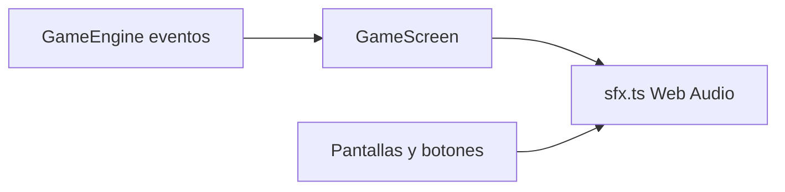

# Plan 2: efectos de sonido y salir del juego

Al iniciar la implementación, guardar este plan en [`Documentacion/Planes/plan_2_sonido_y_salir.md`](Documentacion/Planes/plan_2_sonido_y_salir.md) (no editar el plan de Cursor en `.cursor/plans`).

Restricción de la intención original: sonidos propios, sin muestras de Space Invaders ni paquetes con licencia dudosa.

---

## A. Efectos de sonido

Generar beeps 8-bit con **Web Audio API** (osciladores + envolvente corta). Cero archivos WAV/MP3. El motor no importa audio: emite eventos; la capa UI los reproduce.

Nuevo módulo [`frontend/src/audio/sfx.ts`](frontend/src/audio/sfx.ts):

- `unlock()` en el primer gesto (Iniciar partida / primer clic), para cumplir autoplay del navegador.
- `setMuted(boolean)` y persistencia en AsyncStorage (`neon-swarm.sfx-muted`).
- `play(kind)` con volumen bajo-medio y recorte si hay demasiados sonidos a la vez (máx. ~8 voces).
- En nativo o si no hay `AudioContext`: no-op silencioso.

Ampliar [`frontend/src/types/game.types.ts`](frontend/src/types/game.types.ts) `GameEventType` y emitirlos desde [`frontend/src/game/engine.ts`](frontend/src/game/engine.ts):

- `playerShot` / `enemyShot` — al crear el proyectil.
- `enemyDestroyed` — al hp 0 (pitch distinto por tipo: básico / rápido / tanque).
- `moveStart` — solo al **empezar** a mover (borde pressed), no cada frame; cooldown ~180 ms si se mantiene el rumbo para un tic suave, no ametralladora.
- `hit` / `extraLife` / `waveCleared` / `gameOver` — ya existen; enganchar SFX.
- UI: `uiClick`, `pause`, `resume`, `startGame`, `quit` desde pantallas, no desde el motor.

Mapa de timbre (procedural, estilo arcade):

- Disparo jugador: pulso corto agudo (cuadrada, ~880 Hz, 80 ms).
- Disparo enemigo: pulso más grave (~220 Hz).
- Movimiento: tic grave muy corto (~120 Hz, 40 ms).
- Destrucción: barrido descendente; tanque un poco más largo.
- Impacto al jugador: ruido/descenso.
- Vida extra / oleada limpia: arpegio ascendente.
- Game over: descenso largo.
- UI clic / pausa / salir: clicks distintos y suaves.

Cableado en [`frontend/src/components/GameScreen.tsx`](frontend/src/components/GameScreen.tsx) (loop de eventos) y en [`frontend/src/App.tsx`](frontend/src/App.tsx) / [`frontend/src/components/RetroButton.tsx`](frontend/src/components/RetroButton.tsx) para clics de menú.

Pausa: al pasar a `paused` o `help`, no se generan SFX de gameplay (el loop ya no avanza física). Al salir, `sfx.stopAll()`.

Control de usuario:

- Tecla **M** y botón **Sonido: on/off** en inicio y en pausa.
- Copy en [`frontend/src/copy/es.ts`](frontend/src/copy/es.ts) y fila en la tabla de ayuda.
- Tip: “M silencia el hangar. Los efectos son originales, no hay música de fondo.”

---

## B. Acción salir del juego

En web no se puede cerrar el navegador de forma fiable. **Salir = volver al hangar** (pantalla inicial), sin guardar el puntaje a mitad de partida (solo se persiste en `gameOver`, como ahora).

Cambios:

- [`frontend/src/components/PauseOverlay.tsx`](frontend/src/components/PauseOverlay.tsx): botón **Salir al hangar** (variante ghost).
- Confirmación breve (mismo overlay o modal pequeño): título “Salir al hangar”, contexto “Esta partida no se guardará en el ranking. Puedes despegar de nuevo cuando quieras.” Botones **Salir al hangar** / **Seguir en partida**.
- Tecla **Q** solo con el juego en `paused` (no en `playing`, para no salir por accidente). Documentar en ayuda.
- [`frontend/src/game/input.ts`](frontend/src/game/input.ts): `KeyQ` en códigos de juego; impulso llama `engine.requestQuit()` o callback `onQuit` del `InputManager`.
- [`frontend/src/components/GameScreen.tsx`](frontend/src/components/GameScreen.tsx): al confirmar, `sfx.play("quit")`, detener audio, `onExitHome()`.
- Game over: mantener **Volver al inicio** (ya sale al hangar); no duplicar otro “Salir”.
- Inicio: no hace falta “cerrar app”.

Copy nuevo en `copy.actions.quit`, `copy.a11y.quit`, `copy.quit.confirmTitle/context`, y fila de controles `{ action: "Salir al hangar", primary: "Q", alt: "Solo en pausa" }`. Actualizar tip de pausa.

---

## Verificación

En el navegador: iniciar (debe oírse start + disparos/movimiento/explosiones), M mute/unmute, pausar, Q o botón Salir, confirmar, hangar sin POST de puntaje; cancelar confirmación y reanudar; game over sí guarda ranking. Sin assets de terceros.
